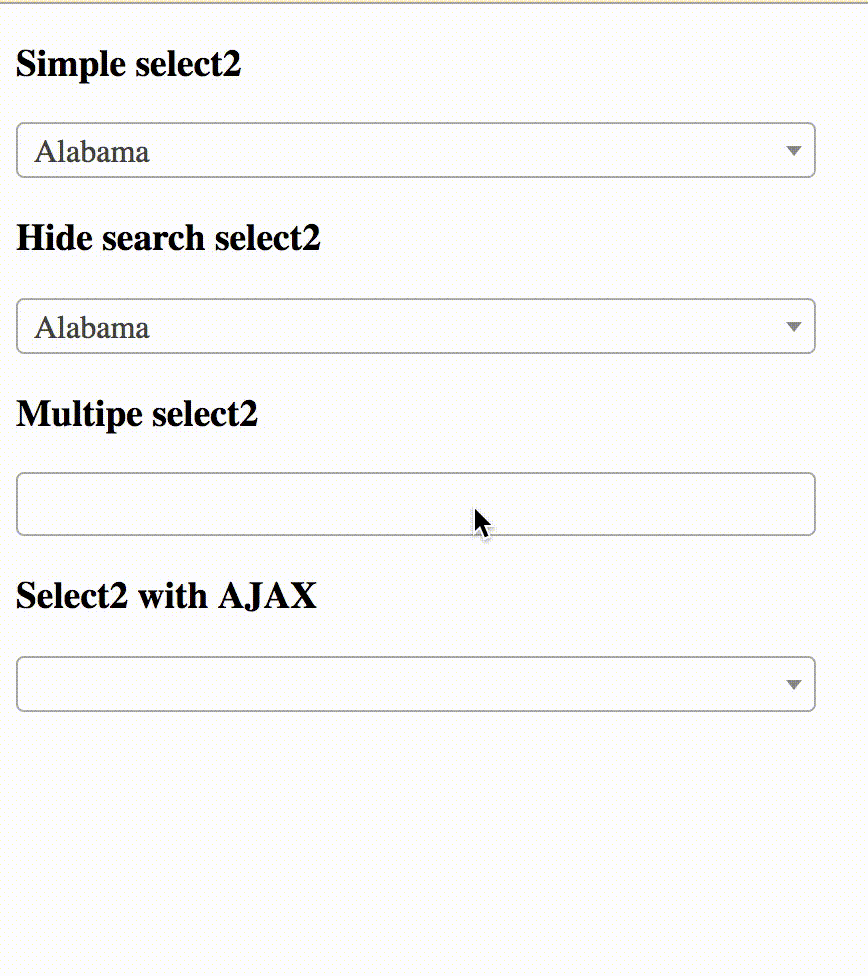

<br>
<p align="center">
   <br><br>
  <a href="https://circleci.com/gh/roquie/laravel-dusk-select2/tree/master">
    
  </a>
  <a href="https://packagist.org/packages/roquie/laravel-dusk-select2">
    
  </a>
  <a href="https://packagist.org/packages/roquie/laravel-dusk-select2">
    
  </a>
  <a href="https://packagist.org/packages/roquie/laravel-dusk-select2">
    
  </a>
  <a href="https://packagist.org/packages/roquie/laravel-dusk-select2">
    
  </a>
</p>

# Introduction

Select2.js support for the Laravel Dusk testing. Support Select2 v3 and Select2 v4 versions.

## Demo

<p align="center">
  
</p>

P.S. This gif slow because I forgot to set [third](https://github.com/roquie/laravel-dusk-select2/blob/master/src/macro.php#L15) parameter to one or zero.

## Install

`composer require --dev roquie/laravel-dusk-select2`

Now, u may use it!

## Upgrade from 0.1.* to 1.0.*

1. Update your `roquie/laravel-dusk-select2` dependency to `^1.0` in your `composer.json` file.
2. Remove ` + .select2` from first parameter, also see [last parameter](./src/macro.php#L17).

## Usage

For default select2:

```php
$browse->select2('@selector');
```

`@selector` class name of your `<select>` html tag. <br><br>
If value not passed, it be selected automatically.

Another way, if need concrete value:
```php
$browse->select2('@selector', 'you_text_value');
```

For multiple mode usage like this:
```php
$browse->select2('@selector', ['foo', 'bar'], 5);
// the last parameter - count of seconds for ajax loading before choice item.
```

## Examples

[Here.](./tests/Browser/Select2Test.php)

## Todo

 * [x] Add Laravel Dusk tests for Laravel Dusk extend feature ;)
 * [x] Add gif demonstration how it works.
 * [x] May be use `+ select2` out of the box?.
 * [x] Integration with Circle CI.

## Tests

[@taylorotwell](https://github.com/taylorotwell) don't kill the kittens, Laravel Dusk also should be used outside of the framework.  

* `cd tests`
* `php -S localhost:8888 tests/index.html`
* `vendor/bin/phpunit`

If u using MacOS, before running `phpunit`, run `vendor/laravel/dusk/bin/chromedriver-mac`.

## License 

[MIT](./LICENSE)
