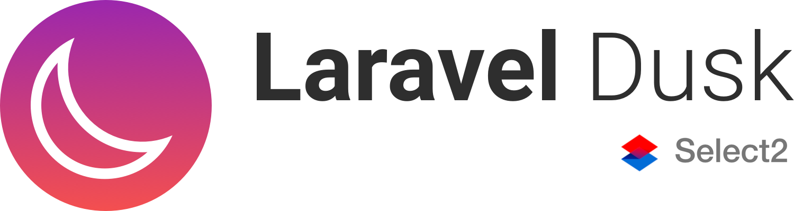
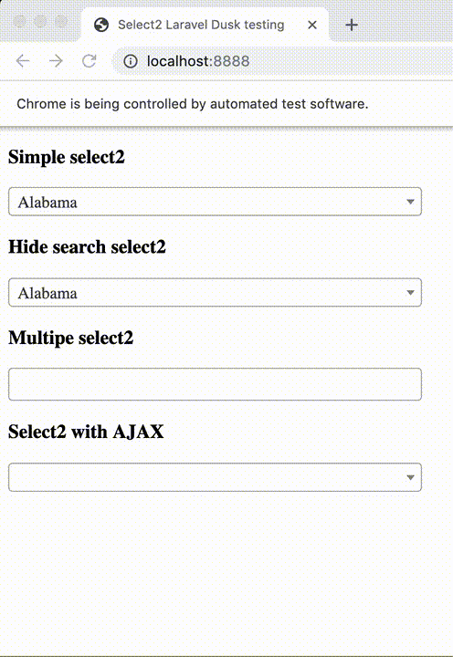

<br>
<p align="center">
   <br><br>
  <a href="https://circleci.com/gh/roquie/laravel-dusk-select2/tree/master">
    
  </a>
  <a href="https://packagist.org/packages/roquie/laravel-dusk-select2">
    
  </a>
  <a href="https://packagist.org/packages/roquie/laravel-dusk-select2">
    
  </a>
  <a href="https://packagist.org/packages/roquie/laravel-dusk-select2">
    
  </a>
</p>

# Introduction

Select2.js support for the Laravel Dusk testing. Support Select2 v3 and Select2 v4 versions.

## Demo

<p align="center">
  
</p>

## Install

`composer require --dev roquie/laravel-dusk-select2`

Now, u may use it!

## Usage

For default select2:

```php
$browse->select2('@selector');
```

`@selector` class name of your `<select>` html tag. <br><br>
If value not passed, it be selected automatically.

Another way, if need concrete value:
```php
$browse->select2('@selector', 'you_text_value');
```

For multiple mode usage like this:
```php
$browse->select2('@selector', ['foo', 'bar'], 5);
// the last parameter - maximum count of seconds for ajax loading before choice item.
```

## Examples

[Here.](./tests/Browser/Select2Test.php)

## Todo

 * [x] Add Laravel Dusk tests for Laravel Dusk extend feature ;)
 * [x] Add gif demonstration how it works.
 * [x] May be use `+ select2` out of the box?.
 * [x] Integration with Circle CI.

## Changelog

Without breaking changes.

### Upgrade from 2.0 to 2.1

#### Migration
1. Update your `roquie/laravel-dusk-select2` dependency to `^2.1` in your `composer.json` file.

#### Changes
1. This project moved back to native dependency `laravel/dusk` package and does not depend on full Laravel Framework like before in 1.*.
2. Tests updated
3. Migrated to new phpunit schema.
4. Updated dependencies to latest versions.
5. Removed `composer.lock`
6. Fixed CI build
7. Tests moved to namespace.
8. Replaced Docker Image who runs these code.

### Upgrade from 1.* to 2.0

`2.0` version of this package potentially has full compatibility with select2 v.3 and v.4.
But, I deleted a lot of code regarding select2 v.3. Tests passed for both versions, but with 
some changes.

#### Migration
1. Update your `roquie/laravel-dusk-select2` dependency to `^2.0` in your `composer.json` file.
2. That's all ...

#### Changes
1. Project migrated to `konsulting/dusk-standalone` package to run tests. It more better solution, compares to download full laravel framework.
2. Tests updated
3. Minimal PHP version is `7.1` (!)
4. Updated dependencies to latest versions.
5. Fixed a bug when search input founded but is not displayed.

### Upgrade from 0.1.* to 1.0.*

1. Update your `roquie/laravel-dusk-select2` dependency to `^1.0` in your `composer.json` file.
2. Remove ` + .select2` from first parameter, also see [last parameter](./src/macro.php#L17).

## Tests

Believe me, it's better to run it all in Docker:

* `make composer test`

## License 

MIT License

Copyright (c) 2017-2020 roquie0@gmail.com

Permission is hereby granted, free of charge, to any person obtaining a copy
of this software and associated documentation files (the "Software"), to deal
in the Software without restriction, including without limitation the rights
to use, copy, modify, merge, publish, distribute, sublicense, and/or sell
copies of the Software, and to permit persons to whom the Software is
furnished to do so, subject to the following conditions:

The above copyright notice and this permission notice shall be included in all
copies or substantial portions of the Software.

THE SOFTWARE IS PROVIDED "AS IS", WITHOUT WARRANTY OF ANY KIND, EXPRESS OR
IMPLIED, INCLUDING BUT NOT LIMITED TO THE WARRANTIES OF MERCHANTABILITY,
FITNESS FOR A PARTICULAR PURPOSE AND NONINFRINGEMENT. IN NO EVENT SHALL THE
AUTHORS OR COPYRIGHT HOLDERS BE LIABLE FOR ANY CLAIM, DAMAGES OR OTHER
LIABILITY, WHETHER IN AN ACTION OF CONTRACT, TORT OR OTHERWISE, ARISING FROM,
OUT OF OR IN CONNECTION WITH THE SOFTWARE OR THE USE OR OTHER DEALINGS IN THE
SOFTWARE.

